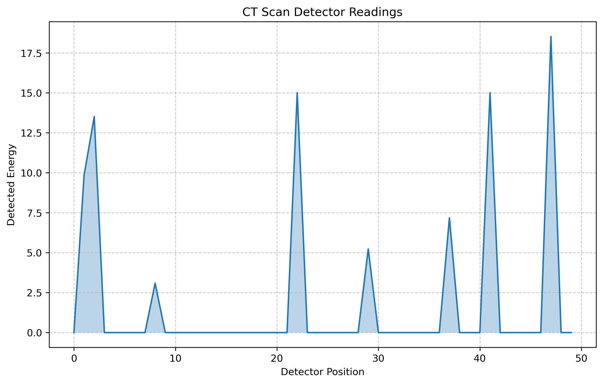

# Monte Carlo Radiation Transportation 


## Overview

This project implements a simplified Monte Carlo simulation of X-ray propagation in a CT (Computed Tomography) scan. It includes a C++ program for the simulation and a Python script for visualizing the results.

The simulation models X-ray photons passing through a sample object and being detected. This process is the basis of CT imaging in medical and industrial applications.

## Requirements

### For the C++ program:
- G++ compiler
- Standard C++ libraries

### For the Python script:
- Python 3.x
- NumPy
- Matplotlib

## Installation

1. Clone this repository:
   ```
   git clone https://github.com/thisisanshgupta/Monte-Carlo-Radiation-Transport-Simulation
   cd Monte-Carlo-Radiation-Transport-Simulation/src
   ```

2. Compile the C++ program:
   ```
   g++ -O3 -std=c++17 -o main main.cpp
   ```

3. Install Python dependencies:
   ```
   pip install numpy matplotlib
   ```

## Usage

1. Run the simulation:
   ```
   ./main
   ```
   This will create a file named `detector_data.txt` with the simulation results.

2. Generate the visualization:
   ```
   python3 visualize.py
   ```
   This will create a PNG file named `ct_scan_graph.png` with a graph of the detector readings.

## File Descriptions

- `main.cpp`: Main C++ program implementing the Monte Carlo simulation
- `visualize.py`: Python script for visualizing the simulation results
- `detector_data.txt`: Output file containing detector readings (generated by the C++ program)
- `ct_scan_graph.png`: Visualization of the detector readings (generated by the Python script)

## Simulation Details

The simulation uses a simplified model of X-ray interactions:

- Photons are emitted from a source and travel through a 2D grid representing the sample.
- The sample contains a circular object with higher density than its surroundings.
- Photons can undergo Compton scattering (changing direction and losing energy) or photoelectric absorption.
- Photons that reach the detector contribute to the final reading.

## Visualization

The generated graph shows:

- X-axis: Detector position (0 to 99)
- Y-axis: Detected energy at each position

The dip in the middle of the graph corresponds to the circular object in the sample, where more X-rays are absorbed or scattered.

## Limitations

This simulation is highly simplified compared to real CT scans:

- It's 2D rather than 3D.
- It uses a monoenergetic X-ray source instead of a realistic spectrum.
- The physics model is simplified.
- It generates only a single projection, not a full set of rotational projections needed for true CT reconstruction.
